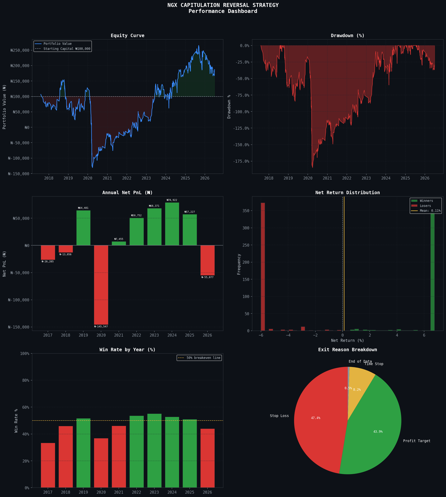

# NGX Capitulation Reversal Strategy

## Overview
A systematic quantitative backtest of a capitulation reversal strategy
across 31 NGX-listed equities, covering 2017-2026 (8.9 years of daily data).
Built as part of the MO_Equity Fund research framework under NGX AMEBO.

## Research Question
Does a capitulation reversal strategy generate positive risk-adjusted returns
on the Nigerian Exchange (NGX) after realistic transaction costs?

## Strategy Rules
| Parameter       | Value                        |
|-----------------|------------------------------|
| Entry Signal    | 5-day return <= -10%         |
| Volume Filter   | >= 1.5x 20-day average volume|
| Profit Target   | +10%                         |
| Stop Loss       | -3% fixed below entry price  |
| Max Holding     | 20 trading days              |
| Position Size   | N100,000 per trade           |
| Entry Execution | Next day opening price       |

## Transaction Costs (NGX)
| Side | Variable | Fixed |
|------|----------|-------|
| Buy  | 1.375%   | N4    |
| Sell | 1.675%   | N4    |

## Key Results
| Metric           | Value       |
|------------------|-------------|
| Backtest Period  | 2017 - 2026 |
| Total Trades     | 784         |
| Win Rate         | 48.2%       |
| CAGR             | 7.30%       |
| Total Net PnL    | N87,323     |
| Profit Factor    | 1.037       |
| Sharpe Ratio     | -0.292      |
| Max Drawdown     | -184.78%    |
| T-bill Benchmark | 26.5% p.a.  |

## Conclusion
The strategy generates a positive but sub-benchmark return of 7.30% CAGR
against a Nigerian 91-day T-bill rate of 26.5%. Transaction costs are the
primary drag, consuming approximately 3% per round-trip trade. The strategy
shows consistent profitability from 2022 onwards.

## Project Structure
ngx-capitulation-reversal-strategy/
    src/
        data_loader.py         # Data ingestion and cleaning
        indicators.py          # Technical indicator engine
        signals.py             # Signal generation
        backtest.py            # Backtesting engine with NGX costs
    results/
        trade_log.csv          # Full trade-by-trade log (784 trades)
        optimisation_grid.csv  # 648-combination parameter sweep
    figures/
        performance_dashboard.png
    README.md

## Stock Universe (31 Stocks)
Abctrans, Aiico, Aradel Holdings, Chams, Coronation Insurance, Cutix,
Daarcomm, Dangote Cement, Dangote Sugar, FCMB, First HoldCo, Guaranty Trust
Holding, Ikeja, Initiates, International Breweries, Japaul Gold Ventures,
Lafarge Africa, Linkassure, MTN Nigeria, McNichols, Mutual Benefits Assurance,
Nahco, Neimeth, Nigerian Breweries, Nigerian Exchange, Secure Electronic Tech,
Tantalizers, UBA, United Capital, Wema Bank, Zenith Bank.

## Author
Moses | MO_Equity Fund | NGX AMEBO Research
NYSC Corps Member - KPMG Deal Advisory, Lagos
ACA Candidate | FinTree Co-Founder

## License
MIT